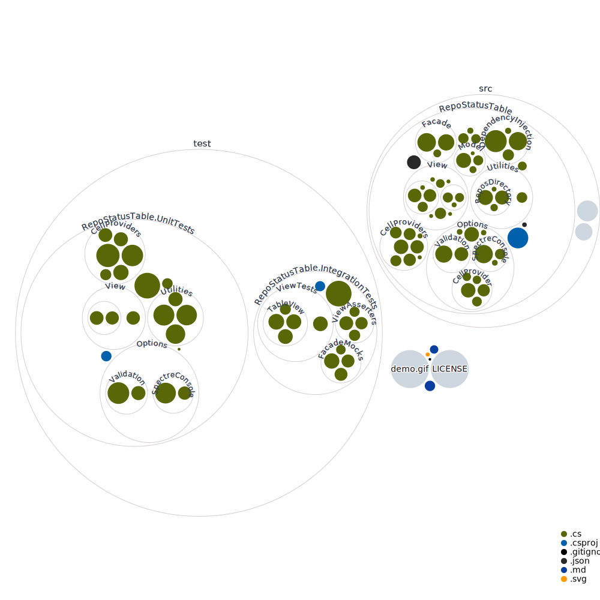

# Repo Status Table

Overview of the status of your Git repositories in tabular form.
Highly customizable.
Pretty useless if you have a monorepo.

## Documentation

Read the [Wiki](https://github.com/MaxAtoms/RepoStatusTable/wiki)

## File Structure Visualization

